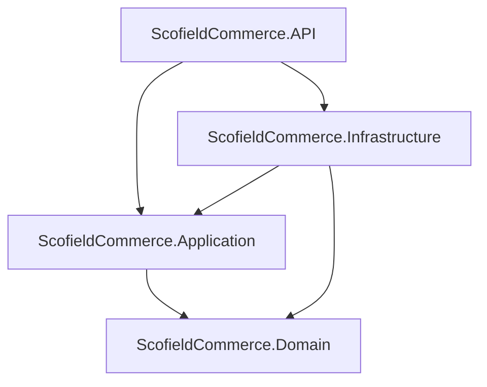

# Scofield Commerce 🚀

Sistema moderno de gestão de vendas e comissões corporativas, desenvolvido com práticas avançadas de arquitetura de software e engenharia de usabilidade. O projeto é composto por uma API robusta em **.NET 10** e uma interface web interativa em **React (Vite + TypeScript)**.

---

## 🏛️ Arquitetura do Sistema

O back-end do sistema segue os princípios da **Clean Architecture** e do **Domain-Driven Design (DDD)**, garantindo a separação de conceitos, facilidade de manutenção e alta testabilidade.

A solução está estruturada nos seguintes projetos:



1. **`ScofieldCommerce.Domain`**: O núcleo da aplicação. Contém as entidades de negócio (`Cliente`, `Venda`, `Produto`, `RegraComissao`), Objetos de Valor (`Cnpj`, `Cep`, `Endereco`) e as validações intrínsecas de domínio. Totalmente livre de dependências externas de frameworks ou banco de dados.
2. **`ScofieldCommerce.Application`**: Contém as regras de aplicação, DTOs, mapeamento e interfaces de repositórios.
3. **`ScofieldCommerce.Infrastructure`**: Responsável pela persistência e comunicação externa. Contém o `ScofieldDbContext` (EF Core), implementações dos repositórios via **Dapper** (para relatórios de alto desempenho) e **Entity Framework Core** (para operações transacionais), além das configurações de migração do banco de dados.
4. **`ScofieldCommerce.API`**: A porta de entrada do sistema. Expõe os endpoints RESTful (Minimal APIs), gerencia a injeção de dependência e as configurações gerais da aplicação.

---

## 🛠️ Tecnologias Utilizadas

### Back-end
* **Plataforma**: .NET 10.0 (C#)
* **Banco de Dados**: PostgreSQL 15 (rodando via Docker)
* **ORM e Acesso a Dados**:
  * **Entity Framework Core**: Utilizado para operações de escrita, garantindo integridade transacional e controle de concorrência.
  * **Dapper**: Empregado na camada de leitura rápida para gerar relatórios e métricas de desempenho complexas no dashboard.
* **Testes**: xUnit com foco em testes de unidade das regras de domínio.

### Front-end
* **Framework**: React.js (com Vite como bundler)
* **Linguagem**: TypeScript para tipagem estática e segurança em tempo de desenvolvimento.
* **Estilização**: TailwindCSS para um design limpo, moderno e responsivo.
* **Gráficos e Componentes**:
  * **Recharts**: Para visualização em tempo real das evoluções de venda diárias e mensais.
  * **Lucide React**: Biblioteca de ícones modernos.
  * **Axios**: Integração centralizada de requisições HTTP à API e a serviços terceiros (como a API pública do ViaCEP).

---

## 🧠 Técnicas e Padrões de Projeto Aplicados

* **Result Pattern**: Em vez de lançar exceções de negócios caras e poluir o fluxo, a API e os serviços utilizam um tipo genérico `Result<T>` ou `Result` que encapsula o sucesso da operação ou uma coleção estruturada de erros de validação.
* **Strategy Pattern com Fuzzy Matching**: Resolução de estratégias de comissão dinâmicas. As taxas de comissões são deduzidas de forma inteligente através de algoritmos de similaridade de strings baseados no nome do produto, sem amarras rígidas.
* **Repository Pattern**: Abstração da lógica de persistência de dados. A camada de domínio/aplicação só conhece contratos (`interfaces`), permitindo que a infraestrutura mude a implementação do banco sem afetar as regras de negócio.
* **Value Objects (Objetos de Valor)**: Conceitos como `CNPJ`, `CEP` e `Endereço` possuem validações encapsuladas que impedem a existência de instâncias em estado inválido na aplicação.

---

## ⚡ Como Executar o Projeto

O projeto está totalmente containerizado com **Docker Compose**, simplificando a inicialização de todos os serviços.

### Pré-requisitos
* **Docker** e **Docker Compose** instalados na máquina de execução.

### Passos para Execução:

1. **Clonar e acessar o repositório**:
   ```bash
   cd scofield-commerce
   ```

2. **Subir toda a infraestrutura (Banco de Dados + API + UI)**:
   ```bash
   docker-compose up --build -d
   ```
   *Este comando construirá as imagens do front-end e do back-end, baixará o PostgreSQL e iniciará as aplicações nos containers.*

3. **Verificar os endereços ativos**:
   * **Front-end (Painel Web)**: [http://localhost:5173](http://localhost:5173)
   * **Back-end (Swagger/Documentação da API)**: [http://localhost:8080/swagger](http://localhost:8080/swagger)
   * **Banco de Dados (PostgreSQL)**: Porta `5432`

4. **Desligar o ambiente**:
   ```bash
   docker-compose down
   ```

---

## 🧪 Executando Testes

Caso queira rodar os testes de unidade da aplicação back-end localmente:

```bash
dotnet test src/API/ScofieldCommerce.sln
```
